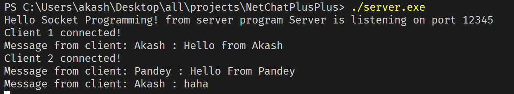
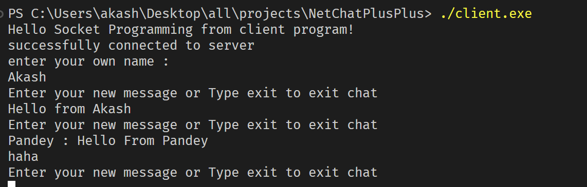
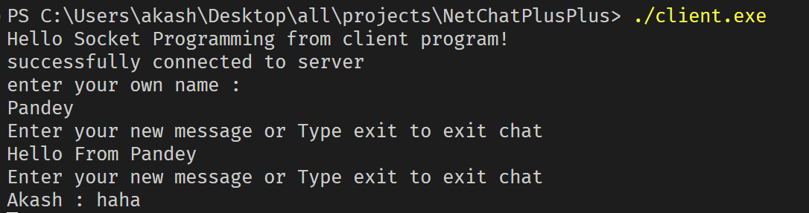

# NetChatPlusPlus 🚀💬



> A powerful, real-time chat application built with C++ and WinSock. Experience seamless communication over a TCP network with a well-structured client-server architecture. 📡✨

## 🌟 About the Project
NetChatPlusPlus is a **multi-client chat application** built using **C++ sockets** and **multithreading**. It enables users to **send and receive messages in real time**, showcasing efficient networking and concurrency handling.

🔹 **Key Features:**
- 🖥️ **Client-Server Architecture**: Supports multiple clients connecting to a central server.
- 🔄 **Full-Duplex Communication**: Simultaneous send & receive operations using **multithreading**.
- 🔌 **TCP Sockets (WinSock2)**: Reliable message transmission with error handling.
- 🚀 **Lightweight & Fast**: Optimized for performance and scalability.
- 🎨 **Readable & Modular Code**: Clean design, easy to extend.

## 📸 Demo Preview
📷 (Include a screenshot/gif of the chat in action)

## 🏗️ Project Structure
```
NetChatPlusPlus/
├── server.cpp  # Server-side implementation
├── client.cpp  # Client-side implementation
├── README.md   # This file
└── ...         # Other dependencies
```

## 🛠️ Technologies Used
- **C++** (Core programming language)
- **WinSock2** (Windows Sockets API for networking)
- **Multithreading** (For concurrent message handling)
- **TCP/IP Protocol** (Reliable communication)

## 🚀 How to Run

### 1️⃣ **Setup the Environment**
Ensure you have **g++ (MinGW)** installed on Windows.

### 2️⃣ **Compile & Run the Server**
```sh
 g++ server.cpp -o server.exe -lws2_32
 ./server.exe
```

### 3️⃣ **Compile & Run the Client**
```sh
 g++ client.cpp -o client.exe -lws2_32
 ./client.exe
```

### 4️⃣ **Start Chatting!** 🗨️
Open multiple client terminals and experience real-time messaging!

## 🔥 Behind the Scenes: How It Works
1️⃣ **Server listens** for incoming client connections.<br>
2️⃣ **Clients connect** and establish a socket-based communication channel.<br>
3️⃣ **Multithreading** ensures that sending & receiving messages happen concurrently.<br>
4️⃣ **Messages are relayed** through the server to all connected clients.<br>
5️⃣ **Exit gracefully** with proper cleanup of sockets and threads.<br>

## 🎯 Why This Project Matters
This project showcases **efficient networking principles, concurrency management, and robust C++ socket programming**. If you're looking to explore real-world applications of networking, **NetChatPlusPlus** is a perfect hands-on experience! 💡💻

## 📌 Future Enhancements
✅ Add support for **encryption** (TLS/SSL) 🔒<br>
✅ Implement **GUI support** (Qt or GTK) 🎨<br>
✅ Support for **Linux/macOS** compatibility 🐧🍎<br>
✅ Database integration for **chat history** 🗂️<br>

## 🤝 Contributing
We welcome contributions! Fork the repo, make improvements, and submit a PR. Let's build something amazing together! 🚀

## 📝 License
This project is licensed under the **MIT License**.

---
🚀 Built with passion & C++! Happy coding! 👨‍💻🔥

